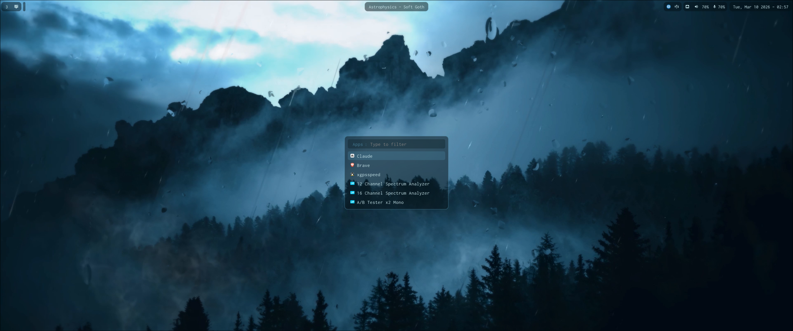

# CachyOS Dotfiles

This repository contains my personal configuration files, which are continuously updated and customized for my daily workflow. 

Core stack: **Hyprland**, Waybar, SDDM.

Currently the most interesting is the script in [./hypr/scripts](./hypr/scripts) which automatically updates the color scheme system-wide for this configuration.

